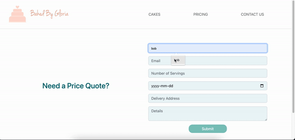

# Baked by Gloria

Baked by Gloria is custom cake website built with Create React App that allows users to browse past cake creations, submit cake inquiries and view pricing lists.

Deployed [here](https://production--schedulerapp-lhl.netlify.app/)

## Final Product

### Demo Video


### Cake Inquiry



## Setup

Install dependencies with `npm install`.

## Running Webpack Development Server

```sh
npm start
```

## Project Stack

- create react app

## Dependencies

- React
- React-dom
- React-scripts
- EmailJS
- Node SASS

## Connect With Me

[Github](https://github.com/gloria-cheung)
-- [Linkedin](http://www.linkedin.com/in/gloria-cheung) --
[Portfolio](http://www.gloria-cheung.com)
